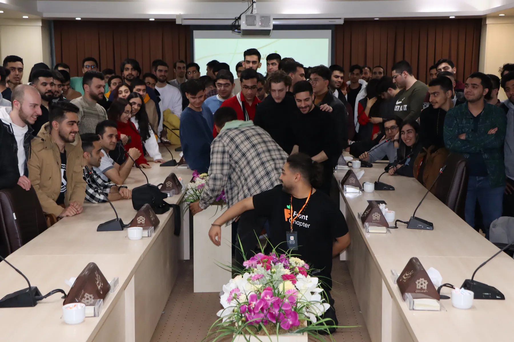

# FrontChapter Community Website



Welcome to the official repository for the **FrontChapter Community Website** — a modern, open-source platform for frontend developers, designers, and tech enthusiasts in Iran and beyond.

---

## 🚀 About FrontChapter

FrontChapter is a vibrant community focused on sharing knowledge, resources, and opportunities in frontend development. Our website is designed to be fast, accessible, and developer-friendly, providing:

- News, articles, and blog posts
- Event announcements and recaps
- Community-driven content
- Team and contributor profiles
- Open-source resources

---

## 🛠️ Technologies Used

- **Next.js** (App Router, SSR, SSG)
- **TypeScript**
- **Tailwind CSS**
- **SCSS** (custom styles)
- **MDX** (dynamic content)
- **PostCSS**
- **Netlify** (deployment)
- **Google Analytics**
- **Disqus** (comments)
- **Semantic HTML**
- **Responsive Design**

---

## ✨ Features

- Multi-author blog system
- SEO optimized
- Customizable theme and config
- Fast page load (optimized images, Next/image)
- Contact form
- Related posts suggestion
- Community team page
- Persian RTL support
- Modern UI/UX

---

## 📦 Getting Started

1. **Clone the repo:**
   ```bash
   git clone https://github.com/frontChapter/frontchapter.git
   cd frontchapter
   ```
2. **Install dependencies:**
   ```bash
   npm install
   # or
   pnpm install
   ```
3. **Run locally:**
   ```bash
   npm run dev
   # or
   pnpm dev
   ```
4. Open [http://localhost:3000](http://localhost:3000) in your browser.

---

## 🏗️ Production Build

```bash
npm run build
# or
pnpm build
```

---

## 🤝 Contributing

We welcome contributions from everyone! Whether you want to fix a bug, add a feature, or improve documentation, feel free to open a pull request or issue.

---

## 📄 License

Released under the [MIT License](LICENSE).

---

## 🌐 Community & Contact

- [FrontChapter Website](https://frontchapter.ir)
- [Contact Us](https://frontchapter.ir/contact)
- [Telegram Channel](https://t.me/frontchapter)
- [Instagram](https://instagram.com/frontchapter.ir)
- [Twitter](https://twitter.com/frontchapter)

---

## 💡 Credits

Developed and maintained by the FrontChapter community. Special thanks to all contributors and supporters!
